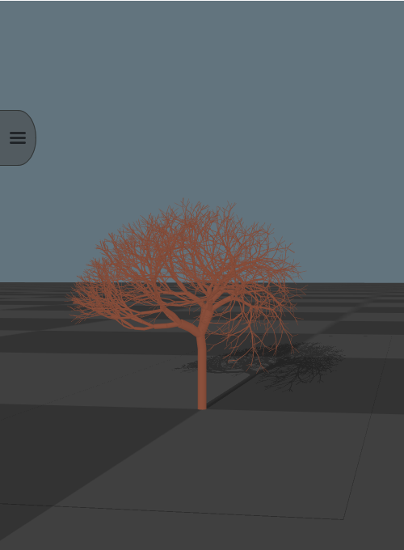
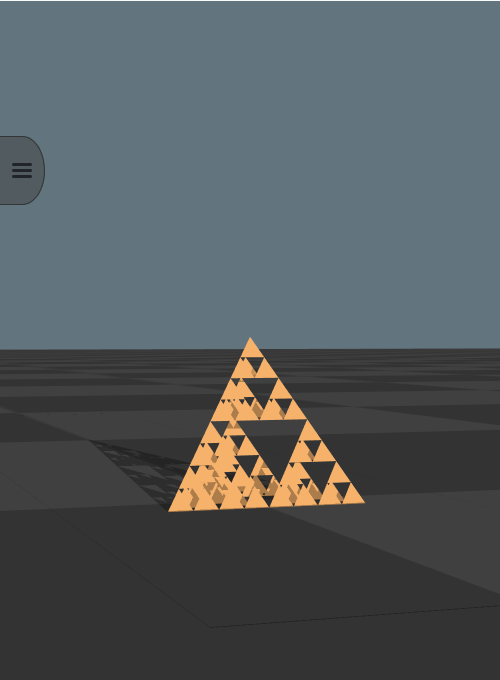
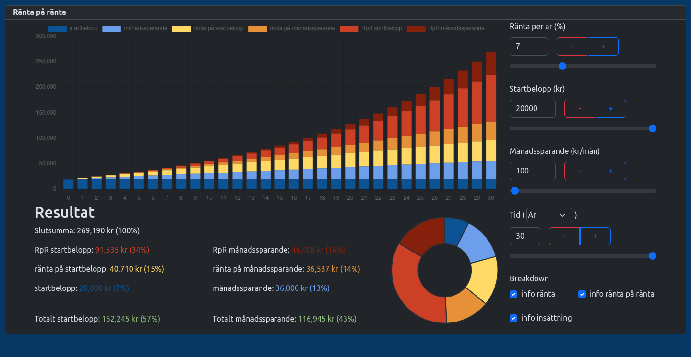
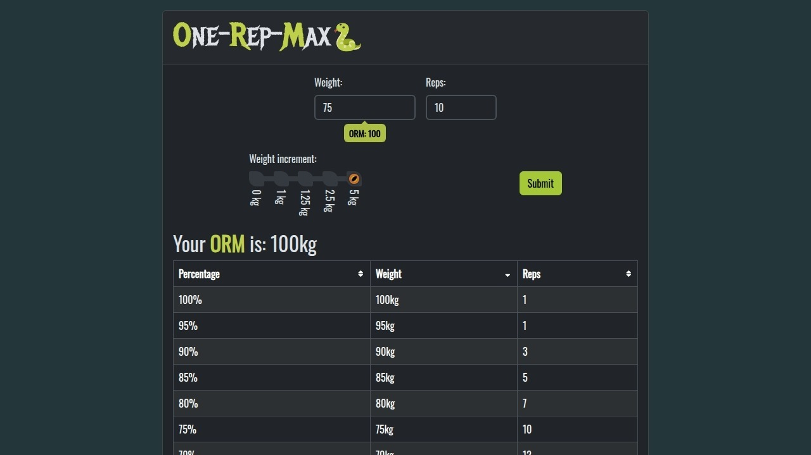

# antfor.gitlab.io

This is the repo for my personal website: https://anton-forsberg.com

## CV

https://anton-forsberg.com/cv

## Projects

### 3D L-systems

https://anton-forsberg.com/projects/l-system

<table>
  <tr>
    <td>
         
    </td>
    <td>
        
    </td>
  </tr>
</table>

### Compound Interest Calculator 

https://anton-forsberg.com/projects/interest#calculator

### One-Rep-Max Calculator

https://anton-forsberg.com/projects/orm?weight=50&reps=10

Also available as a progressive web app (PWA): https://antfor.gitlab.io/orm?weight=50&reps=10

Or on  Google play store: https://play.google.com/store/apps/details?id=com.antonforsberg.com

